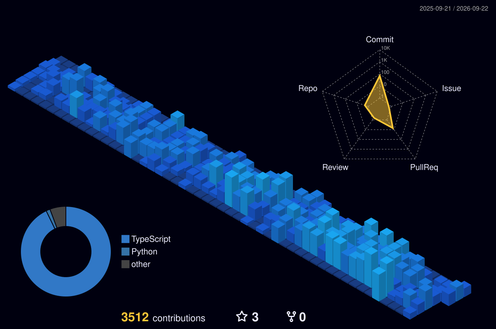

<table>
<tr>

<td width="42%" valign="middle" align="center">

<h3>Frontend Developer</h3>

  I enjoy turning messy ideas and business workflows 
  into clean, practical web experiences.

  Currently exploring automation, 3D web 
  and better ways to build things faster.

 

<b>Tech & Tools</b>

 

</td>

<td width="58%" valign="middle" align="center">

  

  

</td>

</tr>
</table>
